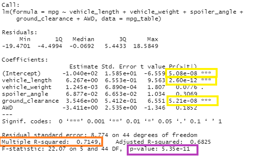
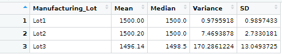

# MechaCar_Statistical_Analysis

## Project Overview
A new prototype, the MechaCar, is experiencing production issues that are impeding the manufacturing team's progress.  Management would like the analytics team to review production data for insights that may aid the manufacturing team.

## Purpose
The purpose of the project will be to conduct a linear regression to predict MPG, collect summary statistics on the PSI of the suspension coils, perform t-tests on the manufacturing lots, and design a study to compare performance against other vehicles.

## Linear Regression to Predict MPG

The vehicle length (p value 2.6x10^-12) and ground clearance (p value 5.21x10^-8) variables provide a non random amount of variance to the MPG values in the dataset.  In addition, the intercept is statistically significant with a p value of 5.08x10-8.  This would indicate that there are likely other factors not included in our dataset that would have an impact on the MPG.

The slope of the linear model is not considered to be zero.  As shown, in the purple box above, the p-value is 5.35x10^-11, which is much smaller than our assumed significance level of .05.  Therefore, there is sufficient evidence to reject our null hypothesis.

The linear model can reasonably predict MPG of the MechaCar.  The r-squared value, as indicated in the orange box above, is .71.  This indicates a 71% likelihood that future data points will fit the linear model.

## Summary Statistics on Suspension Coils

The design specifications for the MechaCar suspension coils dictate that the variance of the suspension coils must not exceed 100 pounds per square inch. To review whether or not all of the manufacturing lots in total comply with this requirement, we can employ the summarize function of R to create a summary data frame.

As seen in the summary dataframe above, the manufacturing lots in total appear to comply with the design specifications with a variance of 62.29 PSI, sufficiently below the maximum variance allowed of 100 PSI.

Knowing that the manufacturing lots in total comply with the variance PSI design specifications, we can proceed with analyzing the individual lots to determine individual compliance.  We can do this by utilizing group by function for manufacturing lots and then again employing R's summarize function to create a summary dataframe.

Lots 1 and 2 do comply with the design specifications with variances of .98 PSI and 7.47 PSI, respectively.  However, we can see that Lot 3 is out of compliance with a variance of 170.29 PSI, thus exceeding the variance of 100 PSI requirement.

## T-Tests on Suspension Coils
briefly summarize findings and my interpretation for the results.  include screenshots

## Study Design: MechaCar vs Competition
short description of a statistical study that can quantify how the mechacar performs against the competition.  think critically about what metrics would be of interest to a consumer (cost, city or hwy fuel efficiency, hp, maint cost, or safety rating).  Address the following questions:
 - what metric or metrics will i test?
 - what is the null or alternative hypothesis?
 - what statistical test would be used to test the hypothesis and why
 - what data is needed to run the statistical test
 