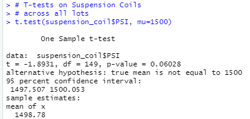
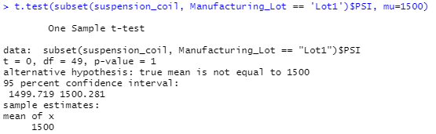
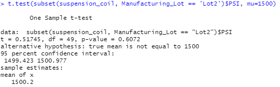
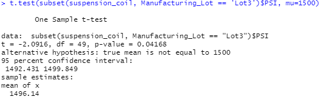

# MechaCar_Statistical_Analysis

## Project Overview
A new prototype, the MechaCar, is experiencing production issues that are impeding the manufacturing team's progress.  Management would like the analytics team to review production data for insights that may aid the manufacturing team.

## Purpose
The purpose of the project will be to conduct a linear regression to predict MPG, collect summary statistics on the PSI of the suspension coils, perform t-tests on the manufacturing lots, and design a study to compare performance against other vehicles.

## Linear Regression to Predict MPG

The vehicle length (p value 2.6x10-12) and ground clearance (p value 5.21x10-8) variables provide a non random amount of variance to the MPG values in the dataset.  In addition, the intercept is statistically significant with a p value of 5.08x10-8.  This would indicate that there are likely other factors not included in our dataset that would have an impact on the MPG.

The slope of the linear model is not considered to be zero.  As shown, in the purple box above, the p-value is 5.35x10-11, which is much smaller than our assumed significance level of .05.  Therefore, there is sufficient evidence to reject our null hypothesis.

The linear model can reasonably predict MPG of the MechaCar.  The r-squared value, as indicated in the orange box above, is .71.  This indicates a 71% likelihood that future data points will fit the linear model.

## Summary Statistics on Suspension Coils

The design specifications for the MechaCar suspension coils dictate that the variance of the suspension coils must not exceed 100 pounds per square inch. To review whether or not all of the manufacturing lots in total comply with this requirement, we can employ the summarize function of R to create a summary data frame.

As seen in the summary dataframe above, the manufacturing lots in total appear to comply with the design specifications with a variance of 62.29 PSI, sufficiently below the maximum variance allowed of 100 PSI.

Knowing that the manufacturing lots in total comply with the variance PSI design specifications, we can proceed with analyzing the individual lots to determine individual compliance.  We can do this by utilizing group by function for manufacturing lots and then again employing R's summarize function to create a summary dataframe.

Lots 1 and 2 do comply with the design specifications with variances of .98 PSI and 7.47 PSI, respectively.  However, we can see that Lot 3 is out of compliance with a variance of 170.29 PSI, thus exceeding the variance of 100 PSI requirement.

## T-Tests on Suspension Coils

Next, t-tests were performed to determine if all 3 manufacturing lots and each lot individually are statistically different than the population mean of 1500 PSI.

### T-Tests Across All Lots

We can see that our p-value is equal to .06, which is above our significance level of .05.  Therefore, there is not sufficient evidence to reject the null hypothesis and the means are statistically similar.

### T-Tests on Individual Lots

 - Lot 1

On Lot 1, we calculate a p-value of 1, which is higher than our significance level.  We are unable to reject the null hypothesis, as this indicates that the means are statistically similar.

 - Lot 2

On Lot 2, the p-value is .61, which is also higher than our significance level.  Therefore, as with Lot 1, we aren't able to reject the null hypothesis on Lot 2.  The mean of Lot 2 is statistically similar to the mean of the population.

 - Lot 3
 

Upon performing a t-test on lot 3, the p-value is determined to be .04.  The p-value is less than our significance level of .05.  We have sufficient evidence to reject the null hypothesis.  We can state that the two means are statistically different.  Greater evaluation of Lot 3 may be necessary.

## Study Design: MechaCar vs Competition

To determine how MechaCar's prototype might perform in the U.S. vehicle market, they will need to compare themselves against their competitors.  MechaCar should consider using the following key metrics: vehicle cost, fuel efficiency, safety ratings, and horsepower.  We will want to determine if there is any statisical difference in each of the above factors based on vehicle manufacturer.  Our null hypothesis would be that the means of all groups are equal.  We can use ANOVA tests for each of the metrics.  Our categorical data type would be the manufacturer and the dependent variable would be the key metric.  ANOVA tests are utilized to determine if there is a statistical difference between the distribution means from multiple samples.  If the p-value for test is less than the significance level of .05,, then we can say that MechaCar is significantly different in that category from the competition.  It is those areas where we can dive deeper to look at whether MechaCar performs better or worse than the competition.  We will need to determine the manufacturers of all of MechaCar's prototype's competitors.  For each of those competitors, we will need to gather vehicle costs for the U.S. market, MPG for city, MPG for highway, safety ratings, and horsepower.
